[](https://github.com/duesee/imap-proxy/actions/workflows/main.yml)
[](https://github.com/duesee/imap-proxy/actions/workflows/audit.yml)

# IMAP Proxy 𓃸

A proxy that receives, `Debug`-prints, and forwards IMAP messages *without changing their semantics* (but see note below).


Thanks to imap-next, the proxy takes advantage of asynchronous I/O, abstracts away literal handling, and fully supports unsolicited responses.

# Quickstart

For now there is no officially released binary. You can install the proxy via cargo ...

```shell
cargo install --git https://github.com/duesee/imap-proxy
```

... and then run ...

```shell
imap-proxy --help
```

... for an overview of arguments. But we suggest to run it directly via cargo ...

```shell
cargo run -- --help
```

... because it allows you to tinker with the source code.

**Important**: You must enable tracing (logging) to see a `Debug`-print of exchanged messages.

To do so, set the `RUST_LOG` environment variable.

Use ...

```sh
RUST_LOG=proxy=trace cargo run
```

... to start the proxy (using the default `config.toml`), enabling all log messages for the "proxy" module.

You should probably experiment with the environment variable. For example, you can use ...

```sh
RUST_LOG=trace cargo run
```

... to enable logs from lower libraries. This way, you will get TLS events and `io/{read,write}/raw` events.

```mermaid  
graph LR;
	Client -->|"① parse Command"| Proxy;
	Proxy  -->|"② change Command (currently no change)"| Proxy;
	Proxy  -->|"③ serialize Command'"| Server;
	Server -->|"④ parse Response"| Proxy;
	Proxy  -->|"⑥ serialize Response'"| Client;
	Proxy  -->|"⑤ change Response (currently no change)"| Proxy;
```



<details>
	<summary>Example Trace</summary>

```
$ RUST_LOG=trace cargo run

# Insecure to Insecure
imap://127.0.0.1:1143 (insecure) -> imap://127.0.0.1:2143 (insecure)

 INFO  Bound to bind_addr_port="127.0.0.1:1143"
 INFO  Accepted client client_addr=127.0.0.1:46500

 INFO  Connecting to server server_addr_port="127.0.0.1:2143"
 INFO  Connected to server server_addr_port="127.0.0.1:2143"
TRACE  io/read/raw data="* OK Hello, World!\\r\\n"
TRACE  <--| role="s2p" greeting=Greeting {
	kind: Ok,
	code: None,
	text: Text("Hello, World!")
}
TRACE  io/write/raw data="* OK Hello, World!\\r\\n"
TRACE  <--- greeting role="p2c"
TRACE  io/read/raw data="A LOGIN {4}\\r\\n"
TRACE  io/write/raw data="+ proxy: Literal accepted by proxy\\r\\n"
TRACE  io/read/raw data="user {4}"
TRACE  io/read/raw data="\\r\\n"
TRACE  io/write/raw data="+ proxy: Literal accepted by proxy\\r\\n"
TRACE  io/read/raw data="pass"
TRACE  io/read/raw data="\\r\\n"
TRACE  |--> role="c2p" command=Command {
	tag: Tag("A"),
	body: Login {
		username: String(Literal(Literal { data: b"user", mode: Sync })),
		password: String(Literal(Literal { data: b"pass", mode: Sync }))
	}
}
```
</details>

## Config

The `config.toml` file has pre-configured scenarios.
The first scenario "Insecure to TLS" is useful for a (local) forwarding proxy and is already enabled.

You can start multiple services using TOML's [array of tables](https://toml.io/en/v1.0.0#array-of-tables) syntax:

```toml
[[services]]
# ...

[[services]]
# ...
```

The `encryption` field configures transport encryption, i.e., `Insecure` or `Tls`.
`Insecure` disables TLS encryption and SHOULD NOT be used when proxying to a remote server.

### Using TLS

#### Create local TLS certificate(s)

You can use [`mkcert`](https://github.com/FiloSottile/mkcert) to create a local certificate authority (CA).
The tool takes care to "register" the local CA with [typical trust stores](https://github.com/FiloSottile/mkcert#supported-root-stores) on your system.

We recommend creating a `private` folder before creating certificates and keys.
The `private` folder is `.gitignore`d, so you can't accidentally push your keys.

```shell
mkdir private
cd private
```

With `mkcert`, you should now be able to create a certificate (+ key), e.g., ...

```shell
mkcert localhost
```

The command creates two files, `localhost.pem` (certificate) and `localhost-key.pem` (key).

#### Configure to accept TLS connections

Edit your `config.toml` ...

```toml
[services.bind.identity]
type = "CertificateChainAndLeafKey"
certificate_chain_path = "private/localhost.pem"
leaf_key_path = "private/localhost-key.pem"
```

... accordingly, start the proxy, and test your connection with OpenSSL, e.g., ...

```shell
openssl s_client -verify_return_error -crlf -connect <host>:<port>
```

Note: `openssl s_client` should only really be used for testing.

# Semantic changes

> A few semantic changes are required to make the proxy more useful.
> These changes are communicated by the proxy, e.g., by emitting a warning or prefixing a `text` field.
> 
> **Literal handling** IMAP allows sending commands "piece-by-piece" using literals.
> However, forwarding single pieces rules out modifications that change the size of a literal.
> Thus, the proxy collects all pieces first and presents single messages that can be easily replaced (if so desired).
> 
> **Capability stripping** Capabilities can introduce fundamental protocol changes.
> Thus, forwarding unknown capabilities would mean we are willing to "lose track" of our session understanding.
> It also implies the proxy needs to forward unparsed messages and (somehow) "get on track" at some later point.
> Doing so requires an in-depth analysis of the problem and its implications.
> Thus, we prefer to strip unsupported capabilities and error out on parsing errors.

# Supported authentication mechanisms

The proxy forwards authentication messages unchanged, and uses an [allow-list](https://github.com/duesee/imap-proxy/blob/main/src/util.rs#L95)
of capabilities and authentication mechanisms to exclude everything it doesn't understand.

Some authentication mechanisms "bind" to the TLS connection ("channel binding") and will fail when proxied.
These mechanisms are not proxyable by design -- at least without further ado -- and are filtered from the connection.

| Authentication mechanism | Support                                |
|--------------------------|----------------------------------------|
| LOGIN                    | supported                              |
| PLAIN                    | supported                              |
| XOAUTH2                  | supported                              |
| SCRAM-*                  | supported                              |
| SCRAM-*-PLUS             | not supported (due to channel binding) |
| Others                   | not supported (yet)                    |

# Future work

The proxy could enrich existing clients' functionality to improve compatibility, performance, and security.
This could be done by fleshing out the proxy into a configurable framework.

Examples:

* Support
  * `XOAUTH2` could transparently be added to non-supporting clients
* Security
    * Encryption could be transparently added such that emails are always appended in encrypted form and decrypted during fetching
* Support & Security
  * Vintage clients could use the proxy as a TLS/Compatibility gateway (See ["Using modern email on vintage clients"](https://julienblanchard.com/articles/modern-email-and-vintage-clients).)
* Performance
  * Support for "capabilities in greetings" or `LITERAL+` could be transparently added to improve performance
* Testing
  * Messages could be forwarded to other software for analysis
  * Protocol traces could be automatically analyzed for supported features
  * Proxy could inject non-semantic changes to expose interoperability issues (See issue #62.)

# License

This crate is licensed under AGPL terms.

# Thanks

Thanks to the [NLnet Foundation](https://nlnet.nl/) for supporting the imap-codec project through [NGI Assure](https://nlnet.nl/assure/)!

<div align="right">
    
    
    
</div>
